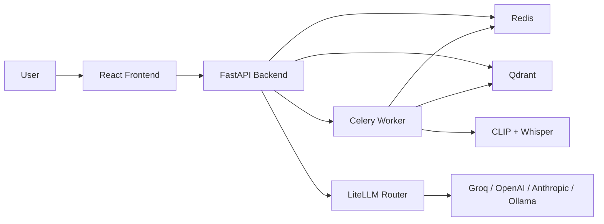

# Multimodal RAG

Search and answer across text, images, audio, and video in one end-to-end system.

## Overview

This project is a full-stack multimodal Retrieval-Augmented Generation (RAG) application. Users can upload documents, images, audio files, and videos; convert them into searchable embeddings; retrieve relevant evidence across modalities; and generate grounded answers with an LLM or VLM.

Unlike a standard text-only RAG pipeline, this system is designed around mixed media. It combines:

- text chunk retrieval
- image embedding and preview retrieval
- audio transcription and search
- video transcript indexing plus visual keyframe indexing
- evidence-first answer generation

## What Makes This Project Interesting

The novelty of this project is not just that it stores multiple file types. The interesting part is that it tries to make them work together in a single retrieval and QA workflow.

Key novelty points:

- **True multimodal ingestion**: text, image, audio, and video are all processed through dedicated ingestion paths.
- **Dual video understanding**: videos are indexed both as transcript chunks and as visual keyframes.
- **Cross-modal retrieval in one interface**: a single query can retrieve evidence from multiple modality collections.
- **Evidence visualization**: retrieved images and video frames are rendered directly in the UI instead of being reduced to filenames.
- **VLM-ready generation path**: when a vision-capable model is configured, retrieved visual evidence can be attached to the generation request.
- **Practical retrieval calibration**: the project includes a ranking fix to reduce the common problem where unrelated text outranks relevant images in mixed-modal search.

In short, the project moves beyond "chat with PDFs" into a more realistic multimodal search-and-answer workflow.

## Core Features

- Upload and ingest text, image, audio, and video files
- Asynchronous ingestion with Celery task tracking
- Vector storage in Qdrant
- CLIP-based shared embedding space for text and images
- Whisper-based transcription for audio and video
- Keyframe extraction for videos every 5 seconds
- Retrieve-only mode for inspecting evidence
- Ask-LLM mode for grounded answer generation
- Streaming answer responses
- Preview rendering for images and video frames
- Frontend filters for modality selection and top-k retrieval
- Structured answer rendering for headings, lists, and bold text

## Architecture



### Main Services

- **Frontend**: React, TypeScript, Vite, Tailwind CSS
- **Backend**: FastAPI
- **Task queue**: Celery
- **Broker / task state**: Redis
- **Vector DB**: Qdrant
- **Embeddings**: local Hugging Face CLIP model
- **Speech-to-text**: Whisper base
- **LLM routing**: LiteLLM
- **Deployment**: Docker Compose

## Tech Stack

| Layer | Technologies |
|---|---|
| Frontend | React, TypeScript, Vite, Tailwind, Lucide, clsx |
| Backend API | FastAPI, Uvicorn, Pydantic |
| Background jobs | Celery, Redis, Flower |
| Vector search | Qdrant |
| Embeddings | `openai/clip-vit-base-patch32` |
| Speech | Whisper base |
| Image / video processing | Pillow, MoviePy |
| LLM gateway | LiteLLM |
| Supported providers | Groq, OpenAI, Anthropic, Ollama |
| Packaging | Docker Compose |

## How It Works

### 1. Ingestion

Each modality has its own ingestion path:

- **Text**
  - PDFs and text-like files are read and chunked
  - Chunks are embedded with the CLIP text encoder
  - Stored in the `text` collection

- **Image**
  - Image is loaded with PIL and embedded with the CLIP image encoder
  - Base64 preview metadata is stored for frontend rendering
  - Stored in the `image` collection

- **Audio**
  - Audio is transcribed with Whisper
  - Transcript segments are embedded with the CLIP text encoder
  - Stored in the `audio` collection

- **Video**
  - Audio track is extracted if present
  - Transcript chunks are created from speech
  - Keyframes are extracted every 5 seconds
  - Transcript chunks and keyframes are both stored in the `video` collection

### 2. Retrieval

- The user enters a query and selects modalities
- The backend creates a CLIP text query vector
- Qdrant is queried across the selected collections
- Results are merged and reranked
- Top-k results are returned to the frontend

Important current behavior:

- default `score_threshold` is `0.0`
- mixed-modality retrieval no longer blindly trusts raw CLIP scores
- text-like hits are lexically reranked to reduce noisy false positives
- images and video frames can stay visible in top-k results

### 3. Generation

- Retrieved chunks are converted into a context block
- The backend sends the query plus context to the configured model
- Responses stream back to the frontend
- If a supported vision model is configured, retrieved images/video frames can also be sent as image inputs

## Frontend Experience

The UI is built around three main actions:

- ingest data
- inspect retrieved evidence
- generate answers from that evidence

Current frontend capabilities:

- drag-and-drop upload panel
- background ingestion job list with progress/status
- modality filters for text, image, audio, and video
- top-k slider
- separate tabs for:
  - retrieved chunks
  - LLM answer
- image preview rendering
- video keyframe preview rendering
- timestamps for audio/video chunks
- page numbers for PDF text chunks
- markdown-like answer rendering

## Supported File Types

### Text

`.txt`, `.md`, `.pdf`, `.json`, `.csv`, `.html`, `.htm`, `.xml`

### Image

`.png`, `.jpg`, `.jpeg`, `.gif`, `.webp`, `.bmp`

### Audio

`.mp3`, `.wav`, `.m4a`, `.flac`, `.ogg`

### Video

`.mp4`, `.mov`, `.avi`, `.mkv`, `.webm`

## Current Model Setup

Current default config:

- provider: `groq`
- model: `compound`

Important note:

- `compound` is useful as a general text-generation path, but it is not the best choice if you want true image understanding.
- For Groq-based visual understanding, a better option is:
  - `meta-llama/llama-4-scout-17b-16e-instruct`

The backend already supports sending retrieved images/video frames into the generation request when a supported vision-capable model is configured.

## Recent Improvements

Several important fixes have already been made:

- lowered the default retrieval threshold so real image hits are no longer filtered out
- improved mixed-modal ranking so unrelated text does not dominate image retrieval
- added preview rendering for retrieved images
- added preview rendering for retrieved video keyframes
- made video ingestion tolerant of silent videos
- improved answer formatting with better prompt instructions
- improved frontend rendering for markdown-like model output
- removed misleading confidence/score badges from the frontend

## Why This Is More Than a Standard RAG Demo

Most student or demo RAG projects stop at:

- upload PDF
- chunk text
- embed text
- ask chatbot

This project goes further by adding:

- multiple media pipelines
- visual retrieval
- transcript-based search
- keyframe-based video indexing
- asynchronous ingestion
- multimodal evidence inspection
- optional VLM integration

That combination is the main novelty and the strongest presentation angle.

## Project Structure

```text
backend/
  embeddings/
  ingestion/
  llm/
  models/
  tasks/
  vector_store/
  config.py
  main.py
  requirements.txt

frontend/
  src/
    api/
    components/
    App.tsx
  package.json

docker-compose.yml
```

## Running the Project

### 1. Configure environment

Create `backend/.env` with values for the provider you want to use. Relevant settings include:

```env
LLM_PROVIDER=groq
LLM_MODEL=compound
GROQ_API_KEY=your_key_here

HF_CLIP_MODEL_ID=openai/clip-vit-base-patch32
QDRANT_HOST=qdrant
QDRANT_PORT=6333
REDIS_URL=redis://redis:6379/0
CELERY_BROKER_URL=redis://redis:6379/0
CELERY_RESULT_BACKEND=redis://redis:6379/1
UPLOAD_DIR=/app/uploads
MAX_UPLOAD_MB=500
```

If you want vision-capable answer generation on Groq:

```env
LLM_PROVIDER=groq
LLM_MODEL=meta-llama/llama-4-scout-17b-16e-instruct
```

### 2. Start services

```bash
docker compose up --build
```

### 3. Open the app

- Frontend: `http://localhost:3000`
- Backend API: `http://localhost:8000`
- API docs: `http://localhost:8000/docs`
- Flower: `http://localhost:5555`
- Qdrant: `http://localhost:6333`

## API Endpoints

| Endpoint | Method | Purpose |
|---|---|---|
| `/api/info` | `GET` | provider/model info |
| `/api/ingest` | `POST` | upload and queue ingestion |
| `/api/task/{task_id}` | `GET` | ingestion task status |
| `/api/retrieve` | `POST` | retrieve relevant chunks |
| `/api/generate` | `POST` | retrieve and generate answer |
| `/health` | `GET` | basic health check |

## Current Limitations

- Text retrieval still uses CLIP, which is not ideal for long-document semantic search
- Cross-modality scores are still not perfectly calibrated
- Video transcript chunks and keyframes share one collection
- No authentication or user isolation yet
- Health checks are minimal
- Collection recreation on embedding dimension mismatch can delete indexed data

## Recommended Next Steps

- move text retrieval to a dedicated text embedding model
- reindex the text collection
- add hybrid retrieval for text
- improve multimodal reranking further
- add tests for retrieval quality
- harden the project for production use

## Best Demo Story

If you are presenting this project, the strongest demo story is:

1. ingest mixed media
2. show retrieved evidence from different modalities
3. show that images/video frames render visually
4. demonstrate grounded answer generation
5. explain the retrieval bugs that were fixed and why multimodal ranking is hard

That makes the novelty immediately visible.

